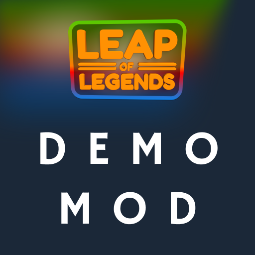

# Leap of Legends — Mod SDK



Create custom game modes for **Leap of Legends** using JSON configuration files.
No coding, no compilation, no DLLs — just define your mode in `mod.json` and play.

## Getting Started

1. **Create a folder** for your mod (e.g., `com.yourname.yourmod/`)
2. **Create `mod.json`** with your game mode configuration (see schema below)
3. **Add a thumbnail** (`thumbnail.png`, 512x512 recommended)
4. **Copy to game**: place folder in `<Game>/LeapOfLegends_Data/StreamingAssets/Mods/`
5. **Launch the game** — your mod appears in the mode selection screen
6. **Upload**: use the in-game Steam Workshop UI

That's it. No build tools, no dependencies, no version conflicts.

## Repository Structure

```
leap-of-legends-sdk/
├── demo/                    ← Complete example mod (Arena Showdown)
│   ├── mod.json             ← Full mod configuration
│   └── README.md            ← Demo-specific docs
├── docs/                    ← Detailed documentation
│   ├── MOD_SCHEMA.md        ← Complete JSON schema reference
│   ├── SECURITY.md          ← Security model
│   └── WORKSHOP_UPLOAD.md   ← Steam Workshop guide
└── README.md                ← This file
```

## Demo Mod — Arena Showdown

The `demo/` folder contains a **complete example** demonstrating every feature:

| Feature | How It's Configured |
|---------|-------------------|
| Teams (Red vs Blue) | `teams.enabled`, `teams.definitions` |
| Custom map with regions | `map.regions` (bases, arena, ice patch) |
| Timer + score-target win | `win_conditions` array |
| Team kill scoring + streaks | `scoring.type`, `scoring.streaks` |
| Team-based spawning | `spawn.strategy: "team_zones"` |
| Full-map camera | `camera.type: "fullmap"` |
| HUD: timer, scores, streaks | `hud` widget array |
| Custom effects | `effects` array |
| AI tuning | `ai` config |
| **30-language localization** | `name_french`, `description_german`, etc. |

## Quick Reference

### mod.json Structure

```json
{
  "id": "com.yourname.yourmod",
  "name": "Display Name",
  "version": "1.0.0",
  "api_version": "1.0",
  "author": "Your Name",
  "description": "Short description",
  "thumbnail": "thumbnail.png",
  "tags": ["pvp", "teams"],

  "name_french": "Nom Français",
  "name_german": "Deutscher Name",
  "description_french": "Description en français",
  "description_german": "Beschreibung auf Deutsch",

  "players": { "min": 1, "max": 6 },

  "ai": {
    "enabled": true,
    "count": 3,
    "chase_range": 14.0,
    "stomp_range": 4.0
  },

  "teams": {
    "enabled": false,
    "count": 2,
    "friendly_fire": false,
    "definitions": [
      { "id": 1, "name": "Red", "color": "#FF4444" },
      { "id": 2, "name": "Blue", "color": "#4444FF" }
    ]
  },

  "map": {
    "width": 26,
    "height": 16,
    "water_height": 2,
    "regions": [
      { "id": "my_zone", "min_x": 1, "min_y": 1, "max_x": 5, "max_y": 10, "cell_type": "air" }
    ]
  },

  "timer": 360,

  "win_conditions": [
    { "type": "timer" },
    { "type": "team_score", "target": 25 }
  ],

  "scoring": {
    "type": "kills",
    "label": "Kills",
    "streaks": { "enabled": true, "announce_at": 3 }
  },

  "spawn": { "strategy": "maximin" },
  "camera": { "type": "fullmap" },

  "hud": [
    { "type": "timer", "anchor": "top_center", "font_size": 36, "flash_below": 30 },
    { "type": "leaderboard", "anchor": "top_right", "max_entries": 6 }
  ],

  "post_match": { "title": "MY MODE", "show_mvp": true }
}
```

### Win Condition Types

| Type | Description | Fields |
|------|-------------|--------|
| `timer` | Ends when timer expires | (uses top-level `timer` value) |
| `score` | Any player reaches target | `target` |
| `team_score` | Any team reaches target | `target` |
| `all_dead` | All human players dead | — |
| `captures` | Team capture count | `target` |

### Scoring Types

| Type | Description |
|------|-------------|
| `kills` | +1 per kill (FFA) |
| `team_kills` | +1 per kill to player and team |
| `resource` | Score = collected resource amount |
| `captures` | Score = flag captures |
| `distance` | Score = distance traveled |

### Spawn Strategies

| Strategy | Description |
|----------|-------------|
| `maximin` | Maximizes distance from other players (default) |
| `random` | Random valid position |
| `team_zones` | Spawn within team's zone (configure `zones`) |
| `team_base` | Spawn at team's base position |
| `behind_leader` | Spawn behind furthest player (scrolling modes) |

### Camera Types

| Type | Description |
|------|-------------|
| `fullmap` | Orthographic view of entire map (default) |
| `follow` | Follows the local player |
| `scrolling` | Auto-scrolling camera |

### HUD Widget Types

| Type | Description | Key Fields |
|------|-------------|------------|
| `timer` | Countdown display | `flash_below`, `flash_color` |
| `team_scores` | Team score bar | `show_target`, `target` |
| `leaderboard` | Ranked player list | `max_entries` |
| `streak_popup` | Kill streak announcement | `min_streak`, `duration`, `color` |
| `player_count` | Alive/total display | — |
| `message` | Custom text | `text` (supports `{target}`, `{time_remaining}`) |
| `resource` | Resource counter | `resource`, `label` |

### HUD Anchor Positions

`top_left`, `top_center`, `top_right`, `center`, `bottom_left`, `bottom_center`, `bottom_right`, `top_bar`

All widgets support `offset_x`, `offset_y` for fine-tuning.

### Localization (Steam API Language Codes)

Localize your mod name and description using Steam's API language codes as key suffixes:

```json
"name_french": "Translated Name",
"description_french": "Translated Description"
```

All 30 Steam language codes: `arabic`, `bulgarian`, `schinese`, `tchinese`, `czech`, `danish`, `dutch`, `english`, `finnish`, `french`, `german`, `greek`, `hungarian`, `indonesian`, `italian`, `japanese`, `koreana`, `norwegian`, `polish`, `portuguese`, `brazilian`, `romanian`, `russian`, `spanish`, `latam`, `swedish`, `thai`, `turkish`, `ukrainian`, `vietnamese`

See [docs/MOD_SCHEMA.md](docs/MOD_SCHEMA.md#localization) for the full mapping table.

### Map Region Cell Types

`air`, `rock`, `water`, `ice`

### Built-in Game Mechanics

These activate built-in systems via the `mechanics` array:

| Type | Description | Key Fields |
|------|-------------|------------|
| `collectible` | Spawned items (coins, gems) | `resource`, `values`, `initial_count`, `scatter_on_death` |
| `flag` | Capture the flag | `auto_return_time`, `pickup_radius` |
| `zone_button` | Area-effect button (Crossfire-style) | `safe_zone`, `cooldown`, `kill_outside` |

### Effect Types (built-in)

| ID | Effect |
|----|--------|
| 1 (0x01) | Speed Boost |
| 2 (0x02) | Jump Boost |
| 3 (0x03) | Speed Slow |
| 4 (0x04) | Invincibility |
| 5 (0x05) | Damage |
| 6 (0x06) | Instant Kill |
| 7 (0x07) | Teleport |
| 8 (0x08) | Gravity |
| 64-255 | Custom mod effects |

## Example Modes

### Simple Deathmatch
```json
{
  "id": "com.you.simpledm",
  "name": "Quick Deathmatch",
  "timer": 180,
  "win_conditions": [{ "type": "timer" }],
  "scoring": { "type": "kills", "label": "Kills" },
  "hud": [
    { "type": "timer", "anchor": "top_center" },
    { "type": "leaderboard", "anchor": "top_right" }
  ]
}
```

### Team Battle (First to 30)
```json
{
  "id": "com.you.teambattle",
  "name": "Team Battle",
  "teams": {
    "enabled": true,
    "count": 2,
    "definitions": [
      { "id": 1, "name": "Red", "color": "#FF0000" },
      { "id": 2, "name": "Blue", "color": "#0088FF" }
    ]
  },
  "timer": 600,
  "win_conditions": [
    { "type": "timer" },
    { "type": "team_score", "target": 30 }
  ],
  "scoring": { "type": "team_kills", "label": "Kills" },
  "hud": [
    { "type": "timer", "anchor": "top_center" },
    { "type": "team_scores", "anchor": "top_bar", "show_target": true, "target": 30 }
  ]
}
```

### Survival (No Timer)
```json
{
  "id": "com.you.survival",
  "name": "Last Frog Standing",
  "timer": 0,
  "ai": { "count": 5 },
  "win_conditions": [{ "type": "all_dead" }],
  "scoring": { "type": "kills", "label": "Kills" },
  "hud": [
    { "type": "player_count", "anchor": "top_center", "font_size": 28 },
    { "type": "leaderboard", "anchor": "top_right" }
  ],
  "post_match": { "title": "LAST FROG STANDING" }
}
```

## Tips

- Start by copying the `demo/mod.json` and modifying values
- Only include fields you want to change — sensible defaults apply for everything else
- Test with AI bots before multiplayer
- Map regions override WFC generation — use them for bases, arenas, corridors
- HUD widgets stack — use `offset_y` to prevent overlap
- AI bots have negative NetworkIds
- Map grid is indexed as `y * Width + x`
- Keep thumbnails at 512x512 PNG for best Workshop display

## License

Mod configurations you create are yours. The demo mod.json is provided under MIT license
as a learning resource.
